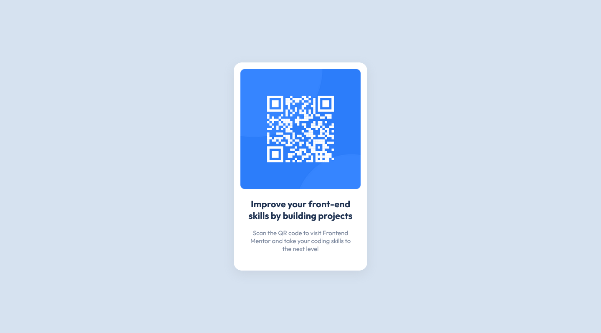

# Frontend Mentor - QR code component solution

This is a solution to the [QR code component challenge on Frontend Mentor](https://www.frontendmentor.io/challenges/qr-code-component-iux_sIO_H). Frontend Mentor challenges help you improve your coding skills by building realistic projects.

## Table of contents

- [Overview](#overview)
  - [Screenshot](#screenshot)
  - [Links](#links)
- [My process](#my-process)
  - [Built with](#built-with)
- [Author](#author)

## Overview

### Screenshot

- Mobile View

  

- Desktop View

  

### Links

- Solution URL: [Github](https://github.com/asdiAdi/qr-code-component-main)
- Live Site URL: [Vercel](https://qr-code-component-main-liart.vercel.app/)

## My process

### Built with

- Semantic HTML5 markup
- CSS custom properties
- Flexbox
- Mobile-first workflow

### Useful resources

- [w3schools](https://www.w3schools.com/) - I used this for extensively for reference.
- [MDN Docs](https://developer.mozilla.org/en-US/) - Another great site for reference.

## Author

- LinkedIn - [@asdiAdi](https://www.linkedin.com/in/asdiAdi/)
- Github - [@asdiAdi](https://github.com/asdiAdi)
- Frontend Mentor - [@asdiAdi](https://www.frontendmentor.io/profile/asdiAdi)
- Freecodecamp = [@asdiAdi](https://www.freecodecamp.org/asdiAdi)
